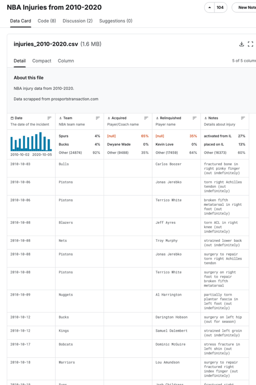
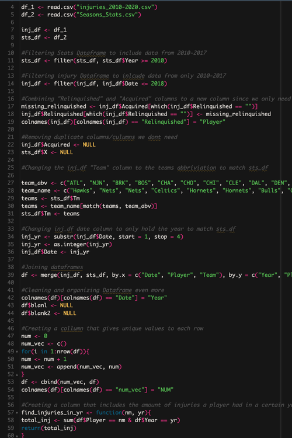
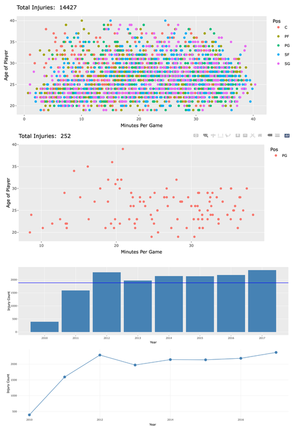
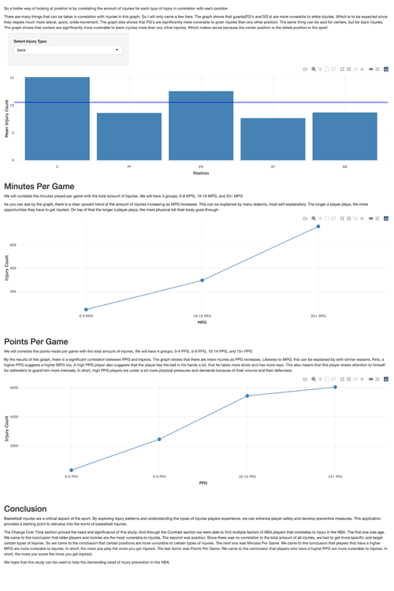

<h1>NBA Injury Explorer: Insights for Prevention - <a href="https://moriojac.shinyapps.io/myapp/">Project Link</a> </h1>

<h2>Description</h2>
This Shiny interactive application visualizes NBA injury data from 2010-2017, allowing users to explore injuries sustained by players and identify potential patterns. Interactive dashboards provide a comprehensive overview of injury trends in professional basketball, ultimately providing insights that can aid in injury prevention.
 

<h2>Languages and Utilities Used</h2>

- <b>R</b> 
- <b>ggplot</b>
- <b>Shiny</b>

  <h1>Project Process</h1>

<table width="100%" style="table-layout: fixed;">
  <tr>
    <td align="center" valign="top" width="25%">
      

        
        <b>Data Collection</b>
        

          For this project, data was collected from two primary sources: an NBA injury catalog and an NBA stats catalog, which can be found below.
        

      

    </td>
    <td align="center" valign="top" width="25%">
      

        
        <b>Data Cleaning and Preparation</b>
        

          With the mix of manual organizing and the help of AI tools, all data from the Word document detailing 52 worship services was extracted and transferred to a CSV file.
        

      

    </td>
    <td align="center" valign="top" width="25%">
      

        
        <b>Data Visualization & Storytelling</b>
        

          Data is manipulated into several visualizations, categorized into two sections:
             <b>Worship Service Insights:</b> Allows users to search by name to access a compiled overview of their service contributions.
        

      

    </td>
    <td align="center" valign="top" width="25%">
      

        
        <b>Interpretation & Decision-Making</b>
        

          The goal of this data is to provide insights into worship service participation, allowing users to explore trends and recognize contributions within the music ministry.
        

      

    </td>
  </tr>
</table>

